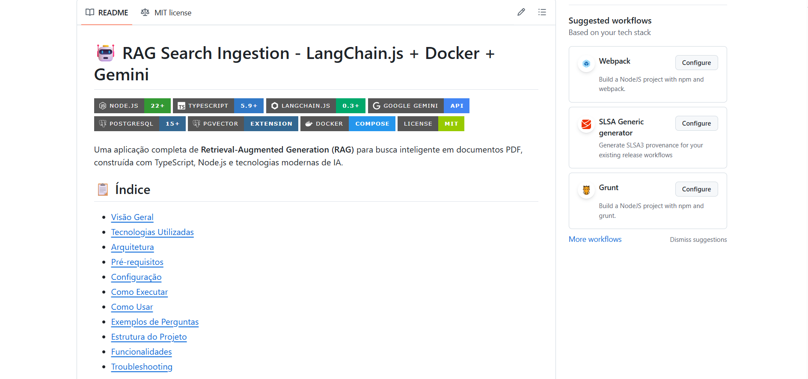

# Sistema RAG Completo: Zero to Hero com TypeScript, Docker, Google Gemini e LangChain.js



A implementação de sistemas de Retrieval-Augmented Generation (RAG) representa uma das abordagens mais promissoras para resolver as limitações fundamentais dos Large Language Models modernos. Este artigo apresenta uma jornada completa na construção de um sistema RAG robusto e escalável, utilizando **[TypeScript](https://www.typescriptlang.org/)** como base de desenvolvimento, **[Docker](https://www.docker.com/)** para orquestração de infraestrutura, **[Google Gemini](https://ai.google.dev/gemini-api/docs/quickstart?hl=pt-br)** para inteligência artificial e **[LangChain.js](https://js.langchain.com/docs/introduction/)** como framework de integração.

Nossa solução permite que usuários façam perguntas em linguagem natural sobre documentos PDF, combinando busca semântica avançada com geração de respostas contextuais precisas. O sistema demonstra como integrar tecnologias de ponta para criar aplicações de IA práticas e escaláveis, abordando desde a extração e processamento de documentos até a geração de respostas contextualmente relevantes.

As tecnologias principais que formam o backbone desta implementação incluem Node.js versão 22 ou superior para runtime JavaScript moderno, TypeScript 5.9 ou superior para tipagem estática robusta, LangChain.js 0.3 ou superior como framework de orquestração de IA, Google Gemini API para embeddings e geração de texto, PostgreSQL 15 ou superior com a extensão pgVector para armazenamento e busca vetorial, e Docker para containerização e implantação simplificada.

> observação: como muitos já sabem, estou fazendo o **[MBA em Engenheria de Software em A.I na FullCycle](https://ia.fullcycle.com.br/mba-ia/?utm_source=google_search&utm_campaign=search_mba-arquitetura&utm_medium=curso_especifico&utm_content=search_mba-arquitetura&gad_source=1&gad_campaignid=21917349974&gclid=Cj0KCQjww4TGBhCKARIsAFLXndQejvz0K1XTOHQ3CSglzOlQfVH64T2CS1qZnwkiyChx0HoXzaK4KY0aAosOEALw_wcB)**, e este artigo é baseado em um dos projetos práticos do curso. Não estou fazendo jabá, apenas compartilhando o conhecimento aprendido e para que outros possam se beneficiar também. Mas, caso queira saber mais sobre o MBA, clique no link anterior.

## Compreendendo RAG e sua importância fundamental

### O Desafio dos LLMs Tradicionais

Large Language Models como GPT, Claude e Gemini revolucionaram o processamento de linguagem natural, mas enfrentam limitações que impedem sua aplicação direta em cenários empresariais e especializados. O conhecimento destes modelos permanece estático, sendo limitado aos dados de treinamento até uma data específica, criando uma lacuna temporal que pode ser crítica em domínios onde informações atualizadas são essenciais.

Além disso, estes modelos tendem a produzir alucinações, inventando informações quando não possuem conhecimento suficiente sobre um tópico. Esta característica pode ser particularmente problemática em aplicações que exigem precisão factual. Os LLMs também carecem de contexto específico sobre dados internos de empresas ou documentos especializados, limitando sua utilidade em cenários onde conhecimento especializado é necessário.

A impossibilidade de atualização pós-treinamento representa outro obstáculo significativo. Uma vez treinado, um modelo não pode aprender novos fatos ou incorporar informações atualizadas sem um processo completo de retreinamento, que é custoso e complexo.

## RAG como solução arquitetural elegante

Retrieval-Augmented Generation emerge como uma arquitetura que resolve elegantemente essas limitações através da combinação de dois componentes fundamentais. 

- **O componente de Retrieval (Recuperação):** funciona como um sistema de busca inteligente que encontra informações relevantes em uma base de conhecimento externa. 

- **O componente de Generation (Geração):** utiliza um LLM para gerar respostas baseadas exclusivamente no contexto recuperado, garantindo que as respostas sejam fundamentadas em informações verificáveis.

O fluxo de processamento segue uma sequência lógica onde uma consulta do usuário é convertida em embedding vetorial, que é então usado para busca por similaridade no banco vetorial. Os documentos mais relevantes são recuperados e concatenados em um contexto, que é fornecido ao LLM junto com a pergunta original para geração da resposta final.

## Vantagens técnicas transformadoras

A arquitetura RAG oferece factualidade através de respostas baseadas em fontes verificáveis, eliminando a necessidade de confiar exclusivamente no conhecimento interno do modelo. A atualização é garantida pois a base de conhecimento pode ser atualizada sem necessidade de retreinar o modelo, permitindo incorporação de novos documentos e informações em tempo real.

A transparência é uma característica fundamental, pois permite rastrear as fontes das informações utilizadas na geração das respostas. A custo-efetividade é significativa, pois evita a necessidade de fine-tuning de modelos, que requer recursos computacionais massivos e expertise técnica especializada.

## Arquitetura do sistema: visão técnica abragente

### Arquitetura de alto nível detalhada

A arquitetura do sistema RAG pode ser visualizada como um pipeline de processamento que transforma documentos PDF  em uma base de conhecimento pesquisável e utiliza essa base para responder perguntas em linguagem natural. O processo começa com um documento PDF que passa por extração de texto, seguida por segmentação inteligente usando LangChain.js. Os segmentos resultantes são convertidos em embeddings vetoriais através do modelo Gemini.

> observação: embora o artigo enfoque em arquivos PDF, numa aplicação RAG, poderíamos utilizar qualquer fonte de dados, como: bancos de dados relacionais, NoSQL, APIs, documentos Word, planilhas Excel, entre outros.

Estes embeddings são armazenados em PostgreSQL com a extensão **[pgVector](https://www.postgresql.org/about/news/pgvector-070-released-2852/)**, criando uma base de conhecimento pesquisável. Quando um usuário faz uma pergunta, ela é convertida em embedding e usada para busca por similaridade no banco vetorial. Os documentos mais relevantes são recuperados e montados em contexto, que é então enviado para o Google Gemini junto com a pergunta para geração da resposta final.

### Afinal, o que são embeddings?

Embeddings são representações numéricas de dados, como texto ou imagens, em um espaço vetorial de alta dimensão. Eles capturam o significado semântico dos dados, permitindo que máquinas compreendam e processem informações de maneira mais eficaz. No contexto de RAG, embeddings são usados para transformar consultas e documentos em vetores que podem ser comparados para encontrar similaridades.

- Exemplo: 

```text
"gato" -> [0.1, 0.3, 0.5, ...]
"cachorro" -> [0.2, 0.4, 0.6, ...]
```

Deixo a recomendação da documentação oficial do Gemini que explica com mais detalhes sobre embeddings: **[Embeddings](https://ai.google.dev/gemini-api/docs/embeddings?hl=pt-br)**

## Componentes tecnológicos em profundidade

Para deixar a aplicação simples e fácil de executar, utilizei de interface que utilizam Node.js com TypeScript para runtime e tipagem estática robusta. A Readline Interface fornece uma CLI interativa para testes e demonstrações, permitindo interação natural com o sistema.

Para processamento de documentos, usamos as seguintes bibliotecas:

- **[LangChain.js](https://js.langchain.com/docs/introduction/):**  serve como framework principal para aplicações LLM, oferecendo abstrações de alto nível para tarefas comuns. 

- **[RecursiveCharacterTextSplitter](https://js.langchain.com/docs/concepts/text_splitters/):** implementa algoritmo inteligente de chunking que preserva contexto semântico. 

- **[PDF-Parse](https://www.npmjs.com/package/pdf-parse):** realiza extração limpa de texto de documentos PDF. 

Os embeddings e IA são gerenciados através da Google Gemini API, utilizando o modelo embedding-001 para geração de embeddings de 768 dimensões e **[gemini-2.0-flash](https://cloud.google.com/vertex-ai/generative-ai/docs/models/gemini/2-0-flash?hl=pt-br)** para geração de respostas otimizadas.

O banco de dados vetorial combina _PostgreSQL 15_ ou superior como banco relacional robusto com _pgVector_ como extensão para busca vetorial eficiente. _HNSW Indexing_ implementa algoritmo de busca aproximada que oferece performance sub-segundo mesmo com milhões de vetores.

### O que é HNSW Indexing?

_HNSW Indexing_ significa _Hierarchical Navigable Small World Graph Indexing._
É uma técnica muito usada em busca aproximada por vizinhos mais próximos _(Approximate Nearest Neighbor Search – ANN)_ em bases vetoriais, como quando você precisa recuperar embeddings de texto, imagens ou áudio de forma rápida.

#### Como funciona?

- Ele organiza os vetores em uma estrutura de grafo hierárquico.

- Nos níveis superiores, você tem conexões mais gerais entre vetores, que permitem "pulos longos" pelo espaço de busca.

- Conforme vai descendo nos níveis, os grafos ficam mais densos e conectados, permitindo buscas mais precisas e locais.

- Isso cria um equilíbrio entre velocidade (saltos rápidos entre regiões) e precisão (ajuste fino nos níveis inferiores).

#### Por que é importante?

- **Alta performance:** consegue buscar vizinhos em milhões de vetores com baixa latência.

- **Escalabilidade:** é eficiente tanto em memória quanto em tempo, mesmo em bases grandes.

- **Uso comum:** é o índice padrão em várias bibliotecas de bases vetoriais, como FAISS (Facebook AI Similarity Search), Milvus, Weaviate e Pinecone.

### Exemplo prático

Imagine que você tem 10 milhões de embeddings de documentos. Se fosse comparar cada consulta com todos, seria inviável.

Com HNSW, você consegue encontrar os documentos semanticamente mais próximos em milissegundos, sem percorrer todos os vetores.


